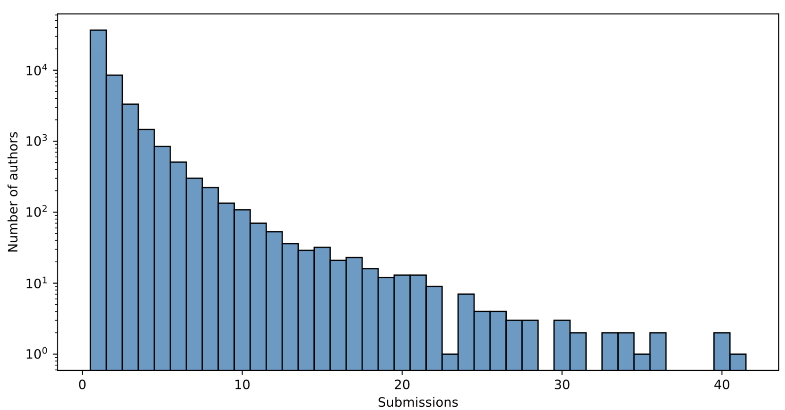

For the ARR May 2026 cycle, we had to make the difficult decision to increase the reciprocal service assignments for submitting authors. The reason for this decision was the substantial increase in submissions compared to previous cycles. In this cycle, we received 17,087 total submissions, with a pool of only 1,424 qualified area chairs and 10,636 reviewers. By comparison, in the January cycle, there were 10,518 submissions, with 1,415 qualified area chairs and 8,633 reviewers. The number of qualified ACs and reviewers is not growing in proportion with submissions. The histogram below shows the distribution of the number of submissions per author in this cycle.

### Our options

We had to make a quick decision to keep the cycle on track once we had all necessary information about reviewer registration. We discussed several options, including: (1) requiring all qualified authors to take the same assignment burden; (2) lowering the qualification threshold for reviewers; and (3) requiring authors with multiple submissions to take on higher service burdens. In the end, we adopted the second and third options. **We are fully cognizant** of the additional effort this entails, especially as this extra burden was unplanned. We are also aware that this may negatively affect the quality of the review process.  We nevertheless hope that the community supports the cycle with high-quality reviews, given the situation.  We genuinely appreciate the effort you put into ensuring scientific quality to the highest extent possible.

### Deficiencies in our communication

While we were deciding how to handle the substantial increase in submissions, there were lapses in communication. For this, we apologize. In particular:

* We should have alerted the community much sooner that the reviewing assignments would need to increase in response to the increase in submissions.  The exact availability of reviewers can only be calculated when we have identified the qualifications of the authors, which takes several days after submission. **Nevertheless,** we should have given everyone more preparatory time, and will do so when this situation arises in future cycles.
* Many of you are upset about receiving a high reviewing load, especially when you had specified a low reviewing load in the maximum availability form.  We did not make it sufficiently clear that the Reviewer Unavailability and Maximum Load Request form **applies to voluntary reviewing service** and not to the mandatory reciprocal service required of authors.  We did not realize this confusion existed due to the wording of the forms.  We are taking steps to repair this problem for future cycles.
* Some authors reached out to us in confusion or with understandable stress at the increased load.  We did not always respond to these authors in a satisfactory manner.  The editors-in-chief, program chairs, and technical support collectively handle an enormous number of inquiries on a daily basis, which leads to impersonal and sometimes abrupt-seeming responses in the interest of dealing with issues in a timely way. We are reviewing our standards for responding to inquiries about mandatory service requirements for authors.
* We are running behind schedule on responding to your emails asking for support. Be assured that we are working as fast as we can to handle the backlog. Many of your emails require additional discussion behind the scenes prior to response.

### Requests to reduce reviewing assignments

With regret, we will not be able to reduce the reciprocal reviewing assignment load in this cycle. If we reduce the reciprocal load for any individual author, we will be unable to find volunteers to take over their efforts. However, for authors who wish to withdraw their submissions in this cycle to avoid the high reciprocal reviewing load, we will waive the withdrawal penalty in this cycle so these papers will be allowed to be re-submitted in the next cycle.

### Looking towards the future

Based on our experience as editors-in-chief and program chairs, the reality is that there appears to be too many good-faith, properly formatted research papers being submitted for the system to handle in certain cycles. It is a "luxury problem": the community is simply too productive by present research standards. The ACL executive and peer review committees are currently reviewing options for addressing the scaling problem with reviewing capacity, including options for limiting submissions for the first time in ACL's history.

Here are two things you can do as an author to help the ARR process in the future:

* If you meet the qualifications, please **volunteer** for service roles, particularly reviewer and area chair, even for cycles where you are not an author.
* **Submit your papers** **in lower-demand cycles**. ARR-reviewed papers can be committed to any conference that subscribes to ARR, even if it is not reviewed in a cycle that coincides with the conference.

The submission crisis affects not only our community, but also adjacent communities in machine learning and other currently-popular technical and scientific fields. Solutions will require input and discussions from ARR, ACL, and the academic world as a whole, especially to address the underlying causes that brought about this situation.
