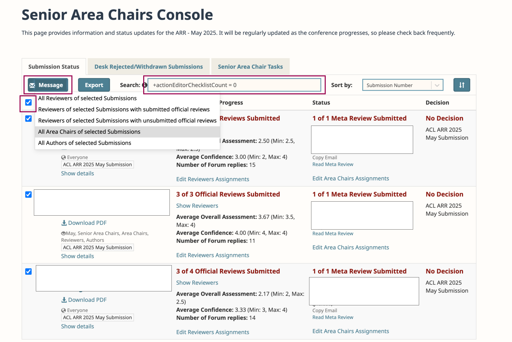
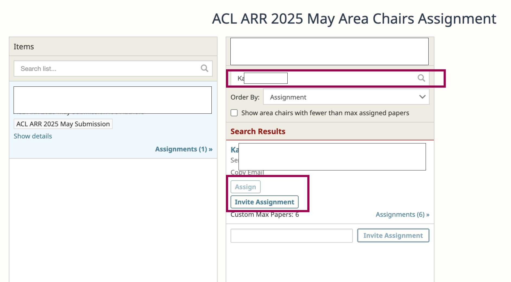
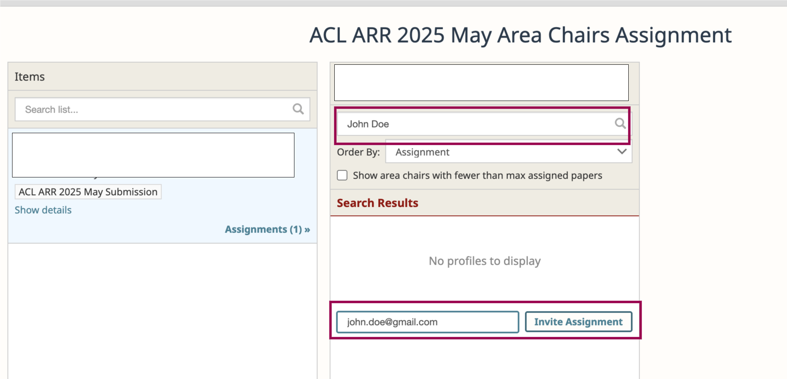
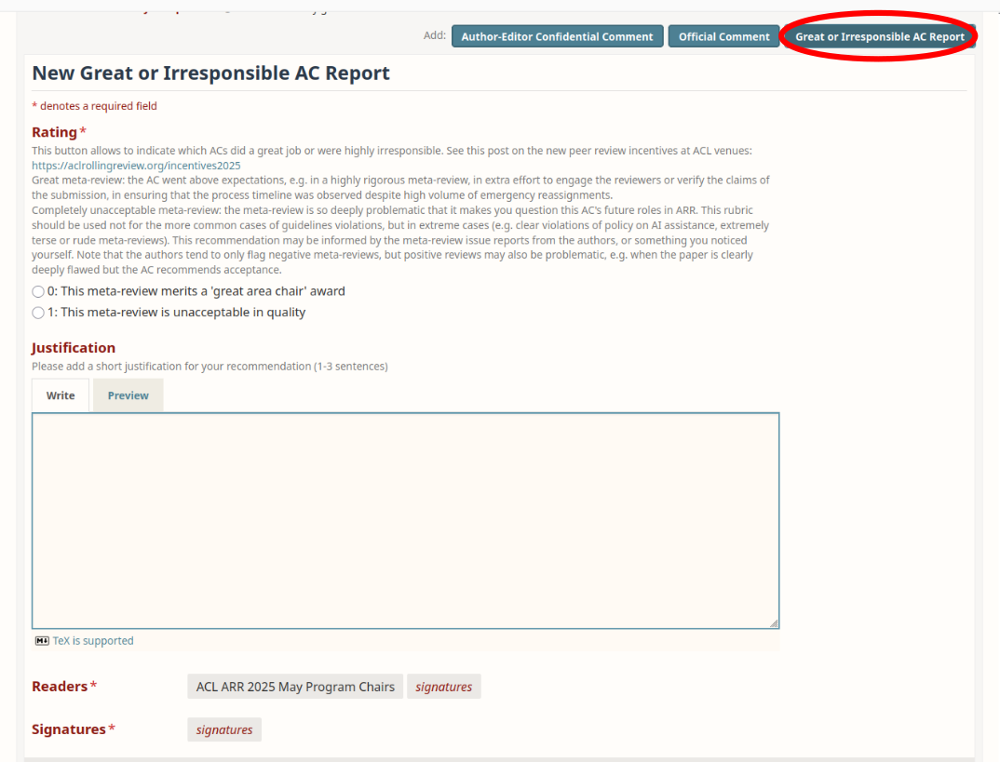
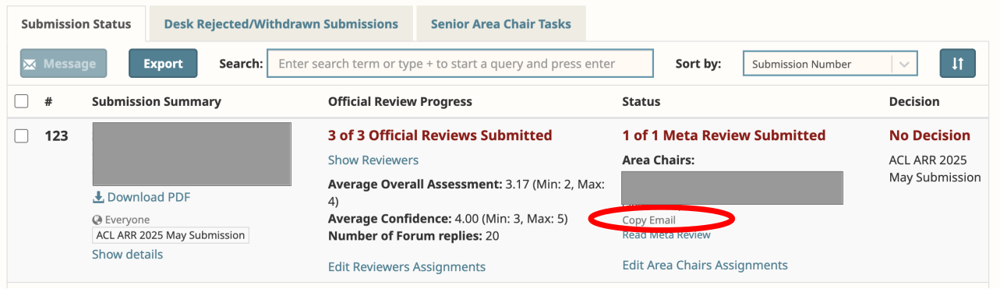

# What does it mean to be a Senior Area Chair at ARR? {#intro}

The exact set of duties depends on whether you were invited to join a cycle that is associated with a specific conference, likely in a specific [track](https://aclrollingreview.org/areas). Either way, your main tasks include the following:

- [checking that all ACs completed the paper checklists](#ac-checklists)
- [helping to chase reviewers, assigning emergency reviewers](#emergency-reviews)
- [making sure that each submission has at least three valid reviews, nominating great reviewers and flagging the irresponsible ones](#quality-check)
- [chasing ACs who are late with meta-reviews, assigning emergency ACs](#emergency-metareviews)
- [nominating great ACs and flagging the irresponsible ones](#metareview-quality-check)

The dates for these tasks for the given cycle are communicated by the editors in the kick-off email for the cycle (the email title should inclue "SAC kick-off email").

If the cycle is associated with a specific conference, the program chairs will also expect you to help at the [commitment stage](#commitment-stage), where the tasks include the following:

- [Making acceptance recommendations compliant with ACL anonymity policy](#acceptance-anonymity)
- [Finalizing the reports of great/unacceptable ACs and reviewers](#incentives)
- [Area chair awards for papers](#paper-awards)

A lot of your work will involve communication with ACs and reviewers. Especially for time-critical communication, we recommend that you generally reach out personally by email rather than through OpenReview, because many people do not read them. 

- [how to find reviewers emails](see here https://aclrollingreview.org/acguidelines#openreview-how-to-find-emails-of-reviewers)
- [how to find AC emails](#contact-ac)

If you do send emails to ACs or reviewers with the OpenReview system, please include your email address or OpenReview ID in the body of the message. Otherwise such emails land in our ticketing system with no indication of which SAC sent the original message.

For your reference, you can find the full instructions given to ARR [authors](https://aclrollingreview.org/authors), [reviewers](https://aclrollingreview.org/reviewerguidelines) and [ACs](https://aclrollingreview.org/acguidelines) on the ARR website.

# ARR review stage tasks

<!--wishlist - should we have a step to check that no ACs in a given SAC batch are clearly unqualified, take note of any that may need feedback/mentoring, and if any such found - request reassignments?-->

## ✅ TASK 1: Checking that all ACs completed the paper checklists {#ac-checklists}

Check that all submissions under your track have a completed checklist by the ACs. Here are the AC guidelines for performing this task: https://aclrollingreview.org/acguidelines#-task-1-initial-submission-checks 

To see which papers are missing checklists, go to the Senior Area Chair console for your cycle. The link looks like this: 

`https://openreview.net/group?id=aclweb.org/ACL/ARR/<YEAR>/<MONTH>/Senior_Area_Chairs`

Where 'month' is the month of the submission deadline. E.g. for May 2025 the link is:

`https://openreview.net/group?id=aclweb.org/ACL/ARR/2025/May/Senior_Area_Chairs`

There, you will see all the papers for which you are responsible.  Go through each of them and verify that the AC checklist is completed. The detailed wording of the questions can be found in https://aclrollingreview.org/acguidelines#completing-the-ac-checklist. 

In order to search the papers for checklist completion, you can use special queries in the search bar:

- `+actionEditorChecklistCount = 0` for papers with no AC checklist
- `+reviewerChecklistCount = 0` for papers with no reviewer checklists

When a + is in front of the search query, an additional information icon appears next to the search bar with more information

This will filter the papers in the Submission Status tab. You can use the checkbox in the header row to select these papers and send emails to different groups related to the paper.

<!--TODO-->

If the AC has not completed their task, please email them and remind them about this task and request them to complete it by the due date. If there are many such ACs, a bulk email can be sent through OpenReview as follows. Select the papers with missing checklists, then click on “Message reviewers” and select the group of recipients (ACs in this case). However, OpenReview emails sometimes get lost in spam filters, or people just do not read them. So generally we suggest you use your personal emails when reaching out if you don’t hear from ACs in a timely manner.

If the AC is unresponsive, that may suggest that they may not do the necessary work; in that case, after reasonable attempts to contact them, assign an AC replacement (after checking their availability) in OpenReview. You can do this in your SAC console by clicking on “Modify Area Chair Assignments” at the top of your console.

### Changing AC assignments {#change-AC-assignments}

1) When the target AC is already in the pool:

<!--TODO-->

2) When AC needs to be added to the pool:

<!--TODO-->

Any new ACs added to the pool should be **qualified according to the [minimal ARR criteria](https://aclrollingreview.org/incentives2025)**: 

- Either a completed PhD, or a main conference *CL publication from more than 5 years ago.
- Four papers in main ACL events or Findings.
- Two additional papers in either main ACL events or major ML/AI venues.
- Extensive reviewing experience.

## ✅ TASK 2: Helping to chase reviewers {#emergency-reviews}

The task of chasing late reviews is mostly performed by ACs, here are their guidelines for that: https://aclrollingreview.org/acguidelines#-task-3-checking-review-quality-and-chasing-missing-reviewers

As a SAC, your task is to proactively work with the ACs of the submissions in your batch so that each submission receives at least 3 reviews by the beginning of the author response period.

For each submission that has less than 3 reviews, please go to the submission page to see the Official Comments and [Emergency Declaration forms](https://aclrollingreview.org/reviewerguidelines#emergency) posted by the AC and/or the reviewer(s). If there is no indication on the page that things are moving along, please get in touch with the AC to see if they have been chasing missing reviews and/or finding emergency reviewers. 

If the AC is not responsive, you have 3 options, depending on how time-critical the situation is and what replacement options are available: 

1. Add a second AC from the existing AC pool via the 'Modify AC assignment' link. Please first send an email to the AC to make sure they are willing to help. 
2. Identify a new qualified AC not in our pool, who agreed to help. In this case, reach out to the PCs to provide their name and OpenReview id. When they are added, you can assign them. 
3. Act as the AC for the submission (meaning that you will chase reviews and/or find emergency reviewers yourself). 

Sometimes contacting an unresponsive AC via your personal email (outside the OpenReview system) does the trick. If you have been unable to reach an AC throughout the chasing period, please follow up with them to clarify if they will perform the rest of their tasks on time, or should be replaced. Note the new policy on [possible penalties for unresponsive reviewers or ACs](https://aclrollingreview.org/incentives2025).

**Sample email text for ACs:** 

(feel free to adjust as appropriate)

-----------------------------
*I am writing to you as a Senior Area Chair for paper __ in the ARR MONTH cycle. The review is now past due, and the author discussion phase starts on __ . Can you please provide an update on reviewing status for this paper?*

*In particular, at this stage we need to know whether you will be able to secure a final review for this paper within the remaining time? Please see previous emails with instructions on how to assign emergency reviewers. If not and as a last resort, I would recommend that you as AC write the review yourself. If you go for this option, please let us know and we can find an emergency AC to do the meta-review for this particular paper.*

*Thanks for your help and hope we can complete the review process for this paper very soon!*

-----------------------------

If you would like to assign emergency reviewers yourself, please follow these [instructions](https://aclrollingreview.org/acguidelines#openreview-how-to-assign-emergency-reviewers).

## ✅ TASK 3: Make sure that each submission has at least three valid reviews {#quality-check}

ARR requires that each submission have at least three valid reviews. In the past, the final check for this was a SAC task, but we realize that this is difficult to do for a large volume of submissions that you are handling. 

Starting from October 2024, ARR has a new mechanism for authors themselves to report problematic reviews (https://aclrollingreview.org/authors#step2.2). This will facilitate your task of checking that all papers receive three reasonable reviews. In particular, we are asking you to check the cases that could qualify for ['highly irresponsible' reviewing](https://2025.emnlp.org/reviewer-policies): missing reviews, extremely terse/unprofessional reviews, reviews suspected of being AI-generated. 

If you have any such cases in your batch, and you find the complaint justified, please discuss the situation with your ACs, and consider obtaining another review (find another reviewer, or have it written by the AC or yourself if you/AC haven't already done another review for the same paper). Please also make sure that either you or the AC [reports any 'highly irresponsible' reviews](https://aclrollingreview.org/acguidelines#review-direct-flagging). The PCs will consider what action to take for such reviewers.

## ✅ TASK 4: Chasing late meta-reviewers {#emergency-metareviews}

The cycle-specific date when the meta-reviews are due was communicated in the kick-off email for the cycle. It is important that the ACs complete this on time, due to the limited buffer time before the upcoming deadlines of the next cycle to which the authors may wish to resubmit. 

If you identify an unresponsive AC, there are three options:

1. Write the meta-review yourself. To do so, you need to assign the submission to yourself as an AC and then the submission will appear in your Area Chair console. Note that you should do this only if you didn’t provide a review for the submission. 
2. Assign an emergency AC from our pool, who had volunteered as an emergency AC. Make sure to respect AC's custom max load. 
3. Assign a new AC who is in your network and agreed to help. See [here](#change-AC-assignments) how to do that in OpenReview.

Once again, it is very important that you send direct messages from your personal email accounts to communicate with the emergency meta-reviewers, since messages sent from OpenReview may end up in the spam folder or simply be ignored. Once you’ve had a positive reply from the person you invite, assign them in OpenReview. Try to give them 24-48 hours to complete the review.

To reassign, go to `Modify Area Chair` assignments in your Senior Area Chair console. The steps are identical to what ACs need to do for emergency reviewing (just need to replace the reviewer with the AC). See slide #15-17 here: https://docs.google.com/presentation/d/1z5hb6Y-tvALSmQYb2skCzv34boG4-QbEBiPKmr8vOX4/edit?usp=sharing

# ✅ TASK 5: Nominating great ACs and flagging the irresponsible ones {#metareview-quality-check}

Here are the full guidelines for writing meta-reviews, which describe what is expected from ARR ACs: https://aclrollingreview.org/acguidelines#-task-5-meta-review 

**Great meta-reviews.** Please recommend for the 'great AC' award any ACs who you see go beyond expectations in ensuring high-quality reviews. ARR is now publicly displaying the names of the best reviewers and ACs, and ACL has adopted a [policy on review incentives](https://www.aclweb.org/adminwiki/images/d/d3/ACL_Conference_Reviewer_Awards_Policy_May_2025.pdf) that includes higher recognition and possibly a free registration to an extra \*ACL conference.

**Unacceptable meta-reviews.** Like with reviews, we recognize that at the current conference scale it is not feasible for SACs to check all meta-reviews for quality. To help you, the authors will have the opportunity to submit [meta-review issue reports](https://aclrollingreview.org/authors#step3.2), which you will be able to see and consider at the commitment stage. Similarly to the reviews, this includes missing meta-reviews, extremely terse/unprofessional meta-reviews, and those strongly suspected of being LLM-generated. Of course, you may also report serious problems you notice yourself, even if the authors did not flag them. 

The mechanism for reporting unacceptable meta-reviews and also for nominating the ACs who went beyond expectations is similar to the [mechanism for marking great/unacceptable reviews](https://aclrollingreview.org/acguidelines#review-direct-flagging). After meta-reviews are finalized, there should be a new button on each meta-review enabling this form. 

<!--TODO-->

If you have any ACs that went completely MIA and did not submit the [emergency declaration](https://aclrollingreview.org/reviewerguidelines#emergency) or [delay notification](https://aclrollingreview.org/reviewerguidelines#delay), and you had to reassign them, this will be detected automatically via the fact that the meta-review was completed by a different AC than originally appointed, and no emergency or delay notifaction from them is present in the forum. You do not have to report anything. 

# ✅ Commitment stage tasks (not handled by ARR) {#commitment-stage}

This section only applies to review cycles directly associated with a specific conference. If you are an SAC in such a cycle, the commitment stage is generally handled by the PCs of the respective conference rather than ARR, and may happen slightly differently in different conferences. It will be done in a separate OpenReview site, to which all reviewed and author-committed papers will be imported. This section hosts general guidelines for the main tasks typically performed at commitment stage, and your conference PCs may communicate additional instructions.

Usually, the 'big' tasks include: 

- making acceptance decisions out of the pool of accepted papers. 
- Nominating papers for 'area chair awards': as the experts in their area, the SACs select one paper in their track, that will be given the area chair award for that track. This process is orthogonal to any best paper considerations by the best paper committee, and the award decisions are made just on the SAC authority.

## ✅ TASK 1: Making acceptance recommendations compliant with ACL anonymity policy {#acceptance-anonymity}

**Anonymity advantage for borderline papers.** When you make decisions for borderline papers, the new ACL policy is that [the borderline papers that were not preprinted during review have an advantage over those that were](https://www.aclweb.org/adminwiki/images/5/56/ACL_Anonymity_Policy.pdf) (see recommendation 'c' on p.2). ARR submission page has a "perprint status" field that you can search for. If the authors said that they were planning or considering to release the preprint, we ask you to search for the paper and see if they did. If so, they lose the anonymity advantage.

**Compromised reviews.** According to the same source, you should not rely on reviews where the reviewers were biased by the knowledge of the authors' identity. To help you estimate that, the review forms contain the question 'Knowledge of/educated guess at author identity'.

## ✅ TASK 2: Finalizing the reports of great/unacceptable ACs and reviewers {#incentives}

`Detailed Instructions Upcoming`

## ✅ TASK 3: Area chair awards for papers {#paper-awards}

SACs have the authority to nominate one paper in their track for area chair award. The same paper may also be nominated for best/outstanding paper awards, in which case  it will also be considered by the best paper committee. But the paper nominated for SAC award in a given track is guaranteed to get that award, irrespective of decisions by the best paper committee. Awards can have a big impact, especially for the early-career authors, and we ask you to not miss this opportunity to reward high-quality work. 

SACs may not give this award to a paper that one of the SACs in the track has a conflict-of-interest (COI) on, but any other paper in their track can be chosen. 

For your reference, these are the overall ACL-recommended criteria for paper awards:

- Is the paper either fascinating, controversial, surprising, impressive, or potentially field-changing? Note that papers do not need to demonstrate all of these properties; any property is sufficient.
- Does the paper present as its motivating use case an application with significant negative social impact? Even if the motivating use case is an application with neutral or positive social impact, are there obvious applications with significant negative social impact which are left unaddressed or insufficiently addressed by the paper? (In such cases, the paper should not be an award candidate.)
- Is the work presented in the paper reproducible? For example, is there sufficient information in the paper to repeat the experiments? If not, is the lack of reproducibility justified in the paper?

Among other desiderata for papers that get awards are: highlighting a broad range of research types and strengths, including types of research that can be conducted at small labs, and/or show excellence in potential positive social impact.

# Optional tasks

These tasks may or may not involve SACs in different cycles. This is only relevant to you if your help with this was requested in a specific cycle.

### Help to update keywords for subfields {#keyword-update}

ARR has a list of keywords associated with different tracks. At present this list is primarily used to help the authors pick the right track for their submission: [https://aclrollingreview.org/areas](https://aclrollingreview.org/areas) 

The PCs of your conference or ARR EiCs *may* ask for your help in revising/updating the list of keywords for some tracks, if they believe it is outdated. Ideally there would be more than 10-15 keywords. The goal is not to exhaust all possible subareas (of which there may be a lot), but to list the ones that you expect to be the most numerous in terms of submissions, based on your knowledge of the recent literature in your area.

# FAQ

## How to Contact other SACs from my track?

You may wish to contact other SACs, e.g. to discuss which paper should be nominated for area chair award, or to discuss recommendations for great/unacceptable reviews or meta-reviews. For conference-associated tracks, the full list of SACs per track is usually published on the conference website. 

## How to contact ACs? {#contact-ac}

- To send an email to a subgroup of your ACs go to your SAC console and in the Area Chair status tab, click on “Message area chairs” where you will be able to select the subgroup of ACs you want to contact.
 
- To contact a specific AC regarding a specific paper, you can use the process above and unselect all but the intended AC. You can also post an official comment where the AC is the intended reader (you can select to hide the message from authors or other groups, too).

However, if you’re concerned about a specific AC that has been silent, we recommend contacting them from personal email addresses, since many people seem to ignore messages from openreview.

<!--TODO-->

## How to contact ARR team?

- For questions on how to use OpenReview to complete your tasks, please contact our Support Team  (`support@aclrollingreview.org`).
- For technical difficulties, errors, and generally in case of suspicious behavior of the OpenReview system, please contact the Tech team (`tech@aclrollingreview.org`).
- For content-based questions (e.g., about the submissions themselves, doubts about AE decisions and tasks, concerns about reviewer assignments, etc.), please contact the  editors-in-chief and associated conference PCs at `editors@aclrollingreview.org`.

Note that official comments in OR are visible to the editors/PCs but they do not receive notifications of new official comments as there would be too many of them; as such, questions requiring input from the editors/PCs should be sent via email (as noted above).

## How to do X in Openreview?
FAQ for how to complete common tasks inside OpenReview can be found in the AC guidelines: https://aclrollingreview.org/acguidelines#faq 

## What if I have an emergency?

If you are affected by a personal emergency, please reach out to us via email to editors@aclrollingreview.org as soon as possible, and also submit the [emergency declaration form](https://aclrollingreview.org/reviewerguidelines#emergency) (this is to ensure that we both act immediately, and do not penalize you for going MIA).
